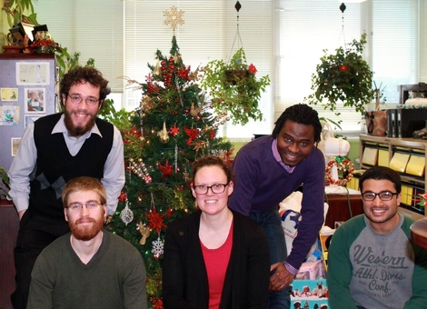

# Research {-}

I am a mathematical biologist. My research considers:

(1) Public health responses to COVID-19 in Atlantic Canada;

(2) Population dynamics with temperature dependence and explicit space; and

(3) Evolutionary epidemiology.

For my publications, see [Google Scholar](https://scholar.google.ca/citations?hl=en&user=bxt9bh8AAAAJ&view_op=list_works&sortby=pubdate)

### Prospective students {-}

I am always looking to support graduate students with a strong interest in mathematical biology, who are interested in deriving, analyzing, parameterizing and validating dynamical systems models in ecology and epidemiology.

If you are interested in becoming a graduate student in my lab, please identify some of my publications that are of interest to you, and how these relate to your future research interests. Please send me an email describing your qualifications and interests.

### Current Trainees{-}

Resources for trainees in the [Hurford Lab](https://ahurford.gitlab.io/resources-for-grad-students/index.html)

- Joshua Renault

- Dr. Maria Martignoni

- Joseph Baafi

- Jake Prosser

- Joany Marino

#### Alumni {-}

```{r Lab, echo=FALSE, purl=FALSE,out.width="60%"}

```

- Dr. Abdou Fofana

- Joe Moran

- Fabio Frazao

- Sovit Chalise

- Matt Rittenhouse


