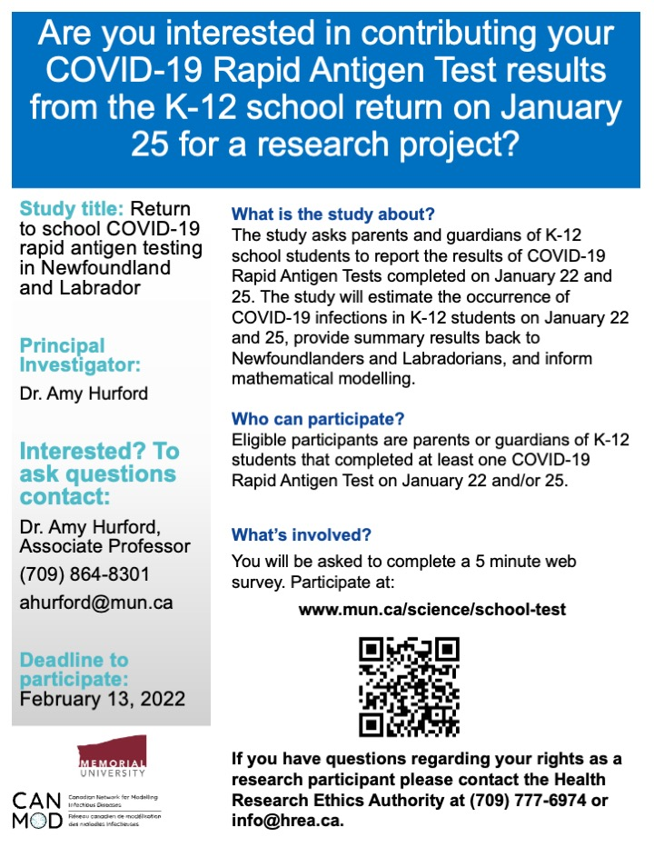

# Return to school COVID-19 rapid antigen testing in Newfoundland and Labrador {-}

## Advertising {-}
1. Use the [CONSENT TO PARTICIPATE IN RESEARCH](https://www.mun.ca/science/school-test/) website and posters (Download: [pdf](https://github.com/ahurford/website/blob/main/figures/School_Test_Poster.pdf) [pptx](https://github.com/ahurford/website/blob/main/figures/School_Test_Poster.pptx)) for social media content and other advertising. 

```{r, echo=FALSE, purl=FALSE,out.width="70%"}

```

2. Ask permission from administrators prior to posting in Facebook groups.

3. Participation in the research study is voluntary. Do not use coersive language such as "_support_ our study". The purpose of advertising is to provide the opportunity to participate.

4. Questions should be directed to Dr. Amy Hurford, (709) 864-8301, or Health Research Ethics Authority at (709) 777-6974 or info@hrea.ca.

5. Efforts should be made to advertise evenly across ethnic groups, in rural and urban communities, and across the entire province. To avoid duplication, and monitor evenness in advertising, if you advertise you may list the location here: https://docs.google.com/document/d/1tnnkni8_yawbfdZn5VSIjN5EQHsVt65wtbYzETlgfK0/edit?usp=sharing

6. 1 survey is to be completed per household and the survey is to be completed by the parents or guardians of K-12 students.

7. [Sheshatshiu Innu School](https://www.cbc.ca/news/canada/newfoundland-labrador/nl-return-to-school-jan-2022-1.6325652) returned to school after January 25 and, as such, are outside the scope of this study which aims to estimate infection prevalence on January 22 and 25 in K-12 students.

## More details on why these data matter {-}
[to be added shortly]
