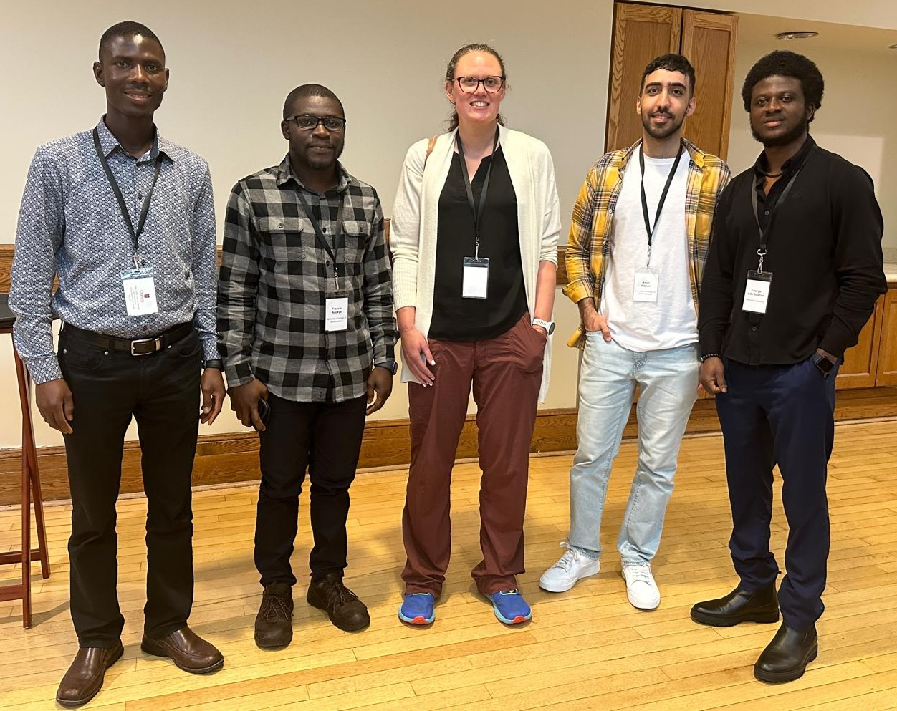
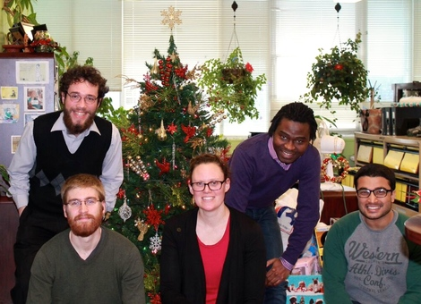

# Students and trainees {-}

<!-- In this CBC interview, I talk about the importance of [infectious disease modelling](https://www.cbc.ca/listen/live-radio/1-210-cbc-newfoundland-morning/clip/16006442-making-sure-were-ready-track-next-disease-concern.) training to support public health. -->

I am always looking to support graduate students with a strong interest in mathematical biology, who are interested in deriving, analyzing, parameterizing and validating dynamical systems models in ecology and epidemiology.

If you are interested in becoming a graduate student or postdoctoral fellow in my lab, please watch the [Society for Mathematical Biology Forum](https://smb.org/Member-Forum), the [Theoretical Ecology Wiki](http://esatheory.wikidot.com/start) for the Ecological Society of America, [IDDjobs](https://iddjobs.org/) and the [Canadian Society for Ecology and Evolution](https://www.csee-scee.ca/category/jobs/) job listings, where I will advertise available positions during the month of October.


<!-- ## Prospective students and trainees {-} -->

<!-- ### MSc, PhD, and postdoctoral fellowship positions in population dynamics and infectious disease modelling - Memorial University, St. John’s, Newfoundland and Labrador {.unnumbered .unlisted} -->

<!-- The _Populations+_ research group led by [Dr. Amy Hurford](https://ahurford.github.io/website/) at Memorial University (St. John’s, Newfoundland and Labrador, Canada) is recruiting MSc, PhD, and postdoctoral fellows with an interest in population dynamics or modelling infectious diseases. -->

<!-- Research projects might consider the impact of climate change on infectious disease, population dynamics, animal and human movement, infectious disease models for decision support and health equity, and strategies for infectious disease control including during pandemics. All projects are to be data-driven, and prospective students should be interested in developing, implementing, and analyzing models that make practical recommendations for decision support. Suitable candidates should have expertise in at least one of: modelling; applied mathematics; data science; biology; epidemiology; or public health, and have strong interest in highly interdisciplinary science and modelling. -->

<!-- Salaries for graduate students will be above the university-determined minimum values ([Biology](https://www.mun.ca/become/graduate/programs-and-courses/biology/) and [Interdisciplinary studies](https://www.mun.ca/become/graduate/programs-and-courses/interdisciplinary-phd/)) and are based on the recommendations of [Support our Science](https://www.supportourscience.ca/). The salary offer does not include tuition (for amounts see [Biology](https://www.mun.ca/become/graduate/programs-and-courses/biology/) and [Interdisciplinary studies](https://www.mun.ca/become/graduate/programs-and-courses/interdisciplinary-phd/)). Funds will be available for conference and workshop participation. The _Populations+_ group maintains a network of mathematical biology collaborators throughout Canada, and trainees are encouraged to participate in activities to build and support their professional development. -->

<!-- The _Population+_ group is located in the [Biology Department](https://www.mun.ca/biology/) at Memorial University in St. John’s, Newfoundland and Labrador, Canada, with research space in the [Core Sciences Facility](https://www.mun.ca/csf/), a state-of-the-art facility completed in September 2021. -->

<!-- To apply please complete the [application form](https://forms.gle/m8SyNnzxuaxksPR16). For full consideration please complete your application by December 1. Applications submitted after this date will be considered if the positions are not filled. Please contact Dr. Amy Hurford (ahurford@mun.ca) with any questions. Individuals that are members of underrepresented groups are particularly encouraged to apply, and contact Dr. Hurford with any questions. -->


```{r, echo=FALSE, purl=FALSE,out.width="60%"}

```

>"I can take it up a notch, can't do it alone."
> -- Alan Doyle


## Current students {-}

- Giuseppe Pasqualino (PhD in Interdisciplinary Studies)

- Francis Anokye (PhD in Interdisciplinary Studies)

- Joseph Baafi (PhD in Biology)

- Laura Bruce (Medical Student)

- Joshua Mack (MSc in Biology)

- Miranda Wallace (MSc in Data Science)

Resources for trainees in the [Hurford Lab](https://ahurford.gitlab.io/resources-for-grad-students/index.html). To write an abstract please following the guidance described in [How to write a Nature summary paragraph](nature-summary-paragraph.pdf). To learn how to write please read [Scientific writing made easy by Turbeck and colleagues](https://esajournals.onlinelibrary.wiley.com/doi/full/10.1002/bes2.1258).


## Graduates {-}

- George Adu-Boahen (MSc in Mathematics)

- Amin Afshari (Honours/SURA). PhD student, Simon Fraser University.

- Dr. Zahra (Mohammadi) Cook, Python Instructor, Canadian Institute for Health Information.

- [Dr. Bo Zhang](https://scholar.google.com/citations?user=BiVBzFYAAAAJ&hl=en)

- [Dr. Maria M. Martignoni](https://scholar.google.ca/citations?user=hy8n248AAAAJ&hl=en), Postdoctoral fellow, Hebrew University of Jerusalem.

- Joshua Renault (USRA)

- Jake Prosser, Data analytics, New Brunswick Institute for Research, Data, and Training.

- [Dr. Joany Marino](https://joanymarino.github.io/#about), Postdoctoral fellow, University Medicine of Greifswald

- Dr. Abdou Fofana, Postdoctoral Research Associate, Boston University.

- Joe Moran, Center for Disease Control (USA).

- Fabio Frazao, PhD student, Dalhousie University.

- Sovit Chalise, HS GovTech Solutions Inc.

- [Dr. Josie Hughes](https://jshughes.org/), Research Scientist, Environment and Climate Change Canada.

- Matt Rittenhouse, Data analyist, Goodlife fitness.

```{r Lab, echo=FALSE, purl=FALSE,out.width="60%"}

```

