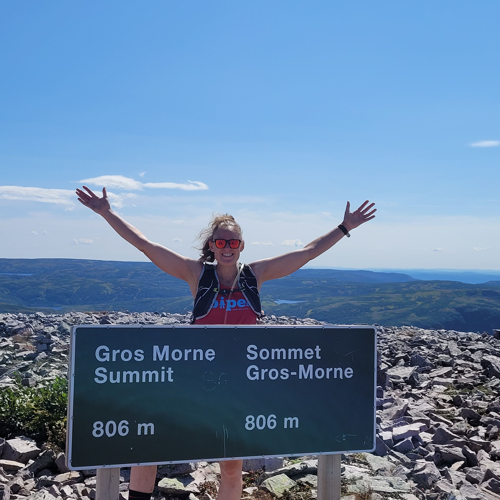

# Links {-}

- [Share your science workshop](https://rpubs.com/ahurford/972071)

- [BIOL 4605](https://davidcschneider.github.io/StatisticalScience/LNotes/Pt1.html)

- [AARMS-EIDM summer school](https://ahurford.github.io/aarms-summer-school/)

- I am a former [student-athlete](https://youtube.com/clip/Ugkxz7WysQ5wcUwP5XGW2LUH3N_BghyDQDFN). I have completed the east coast trail ultra, and several half-ironmans.


```{r, echo=FALSE, purl=FALSE,out.width="50%", fig.align = 'center'}

```
