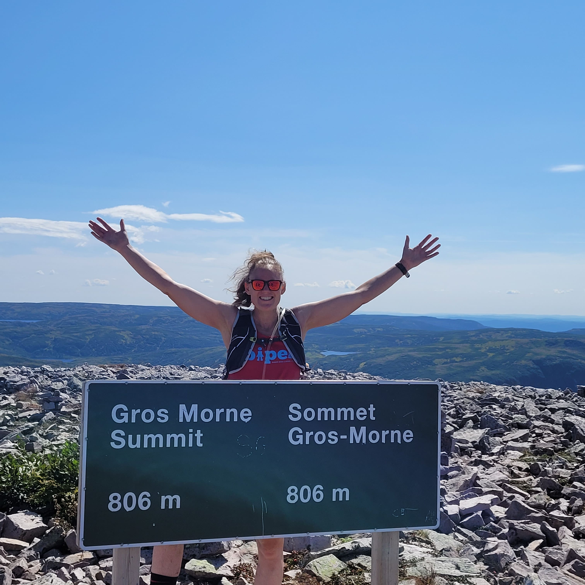

# Links {-}

- Maud Menten Institute [pdf](docs/mmi-dec-2024.pdf) [ppt](docs/mmi-dec-2024.ppt) (December 2024).
- [Share your science workshop](https://rpubs.com/ahurford/972071)

- [BIOL 4605](https://davidcschneider.github.io/StatisticalScience/LNotes/Pt1.html)

- [Advocating for a better work-life balance in academia](https://thefemalescientist.com/portrait/maria-martignoni/3111/go-for-it/) by Dr. Maria Martignoni.

- I am a former [student-athlete](https://youtube.com/clip/Ugkxz7WysQ5wcUwP5XGW2LUH3N_BghyDQDFN). I have completed ultra-marathons, marathons, and half ironmans.

{height=250}
{height=200} 
{height=250} 
{height=250} 

