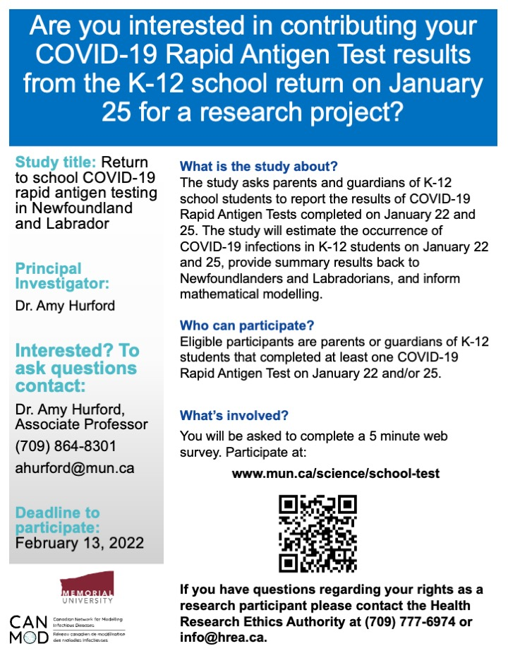

# Return to school COVID-19 rapid antigen testing in Newfoundland and Labrador {-}

## Advertising {-}
1. Use the [CONSENT TO PARTICIPATE IN RESEARCH](https://www.mun.ca/science/school-test/) website and posters (Download: [pdf](https://github.com/ahurford/website/blob/main/figures/School_Test_Poster.pdf) [pptx](https://github.com/ahurford/website/blob/main/figures/School_Test_Poster.pptx)) for social media content and other advertising. 

```{r, echo=FALSE, purl=FALSE,out.width="70%"}

```

2. Ask permission from administrators prior to posting in Facebook groups.

3. Participation in the research study is voluntary. Do not use coersive language such as "_support_ our study". The purpose of advertising is to provide the opportunity to participate.

4. Questions should be directed to Dr. Amy Hurford, (709) 864-8301, or Health Research Ethics Authority at (709) 777-6974 or info@hrea.ca.

5. Efforts should be made to advertise evenly across ethnic groups, in rural and urban communities, and across the entire province. To avoid duplication, and monitor evenness in advertising, if you advertise you may list the location here: https://docs.google.com/document/d/1tnnkni8_yawbfdZn5VSIjN5EQHsVt65wtbYzETlgfK0/edit?usp=sharing

6. 1 survey is to be completed per household and the survey is to be completed by the parents or guardians of K-12 students.

7. [Sheshatshiu Innu School](https://www.cbc.ca/news/canada/newfoundland-labrador/nl-return-to-school-jan-2022-1.6325652) returned to school after January 25 and, as such, are outside the scope of this study which aims to estimate infection prevalence on January 22 and 25 in K-12 students.

## More details on why these data matter {-}

1. Data informs the science, that informs the policy and decisions, that effect us all. Important decisions should be guided by high-quality evidence.

2. [A community-based initiative](https://www.cbc.ca/news/canada/newfoundland-labrador/nl-parents-covid-group-1.6343350) allows for reporting of rapid antigen tests in schools. The provincial government plans to provide submission portal for positive rapid antigen test results. All these initiatives, in addition to this research project, are valuable, and these initiatives are distinctly different and serve different purposes. This research project is designed to quantify the number of undetected Omicron cases. This objective is best met as research-led initiative.

3. The impact of reopening is critically dependent on the number of people with recent infection. See Slide 10 of the [Ontario Science Table's projections](https://covid19-sciencetable.ca/wp-content/uploads/2022/02/Update-on-COVID-19-Projections_2022.02.01_English-4.pdf) released February 1.

4. Estimating the number of people with recent infections is challenging [without a reliable estimate of case counts](https://covid19-sciencetable.ca/wp-content/uploads/2022/02/Update-on-COVID-19-Projections_2022.02.01_English-4.pdf). For Newfoundland and Labrador, the rapid antigen test results from K-12 students January 22 and 25 are valuable to compare with the provincially reported PCR counts from that time to understand the reliability of the daily case count updates.

5. PCR testing eligibility in many provinces has prioritized older age groups (i.e. [Nova Scotia](https://www.nshealth.ca/coronavirustesting)). The K-12 rapid antigen test results are valuable as younger age groups have been less tested during the Omicron wave.
