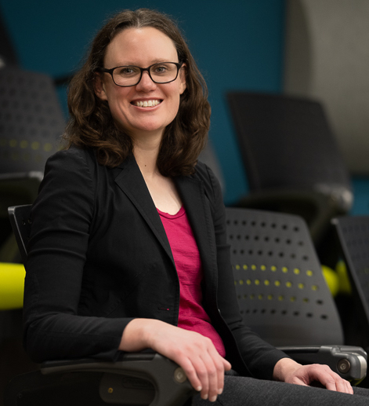

--- 
site: bookdown::bookdown_site
output: bookdown::gitbook
documentclass: book
biblio-style: apalike
link-citations: false 
github-repo: ahurford/website
---

# Dr. Amy Hurford {-}

<style>
  .col2 {
    columns: 2 200px;         /* number of columns and width in pixels*/
    -webkit-columns: 2 200px; /* chrome, safari */
    -moz-columns: 2 200px;    /* firefox */
  }
  .col3 {
    columns: 3 100px;
    -webkit-columns: 3 100px;
    -moz-columns: 3 100px;
  }
</style>

<style>
.column-left{
  float: left;
  width: 50%;
  text-align: left;
}

.column-right{
  float: right;
  width: 50%;
  text-align: left;
}
</style>

<div class="column-left">
```{r HeadShot, echo=FALSE, purl=FALSE,out.width="70%"}

```
</div>

<div class="column-right">
I am an Associate Professor jointly appointed in the [Department of Biology](https://www.mun.ca/biology/) and the [Department of Mathematics and Statistics](https://www.mun.ca/math/) at [Memorial University of Newfoundland and Labrador](https://mun.ca/).

My research is in theoretical ecology, evolution and epidemiology.

I recently developed the [MUN Biology BSc Quantitative Training Program](https://ahurford.github.io/quant-guide-all-courses/) together with Dr. Yolanda Wiersma.

Contact: ahurford@mun.ca

### Education {-}

- PhD, 2012. Mathematics & Statistics, Queen's University
- MSc, 2005. Biological Sciences, University of Alberta


 </div> 

<div class="column-left">

```{r logo, out.width="70%", echo=FALSE, purl=FALSE}

```

[Schedule](https://calendar.google.com/calendar/embed?src=hurford.amy%40gmail.com&ctz=America/St_Johns)

[Google Scholar](https://scholar.google.ca/citations?hl=en&user=bxt9bh8AAAAJ&view_op=list_works&gmla=AJsN-F4WdeYtdxaBnNoWImjkkpr7uIH2KAhBa0wQrx0NWE_jorLbjasr8KMungYLGwP_Wp7eGMArwXpeErtX3ohHq-SuENXpbtFQH1xkK0bFizC57LJzgUY)

[Twitter](https://twitter.com/amy_hurford) 

[Github](https://github.com/ahurford)

</div>
